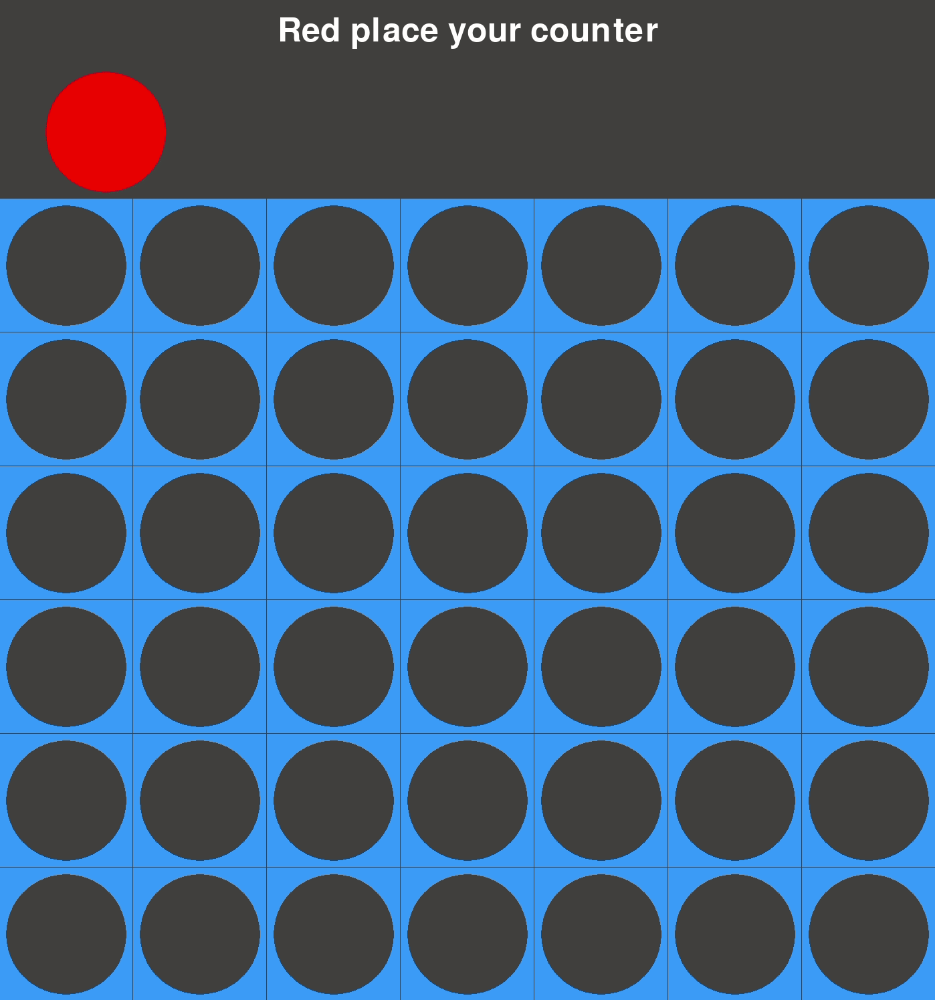
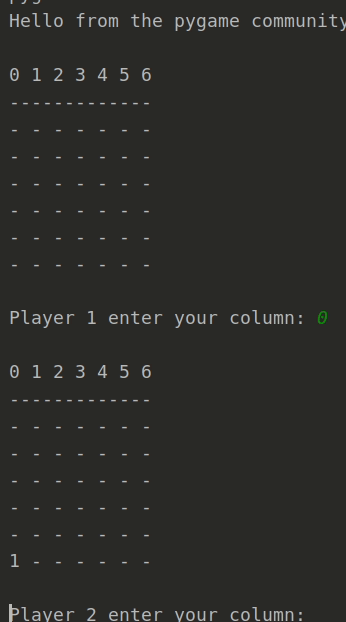

# Connect Four with AI

## AI Element
**NOTE: The AI element is currently under development.**

### Optimisations

#### Negamax Search
Implements the negamax recursive algorithm to minimise the possible loss for a worst-case scenario.

The computer player wishes to maximise its score, future moves/board states are therefore scored from both players perspectives. Simply, it maximises the score for itself and minimises it for the opponent.

#### Alpha-Beta Pruning
Utilises Alpha-Beta Pruning to narrow the exploration window by taking into account previously explored moves.

The number of nodes evaluated by the negamax search is therefore decreased. Evaluation for a move is stopped when there has been >= 1 other possibility found that proves the move to be worse than a previously explored move.

#### Exploration Ordering
We can further narrow the exploration window following Alpha-Beta Pruning by exploring columns closer to the centre and moving outwards. 

This is as moves closer to the central column are involved in more alignments.

#### Bitmap Encoding of Board States
Our board state can be stored as a bit map. 

(TODO: Complete)

#### Future Optimisation Plans/Ideas
* Anticipation of losing moves
* Iterative deepening
* The implementation of a transposition table for the caching of moves

## Key Releases
* [Player Vs Player V1.0 Released with GUI and CLI Interfaces](https://github.com/maw101/ConnectFourAI/releases/tag/PvP-V1.0)

## Demos
### Player vs Player
[V1.0 Released with GUI and CLI Interfaces](https://github.com/maw101/ConnectFourAI/releases/tag/PvP-V1.0)
#### Graphical User Interface (GUI)

#### Command Line Interface (CLI)

